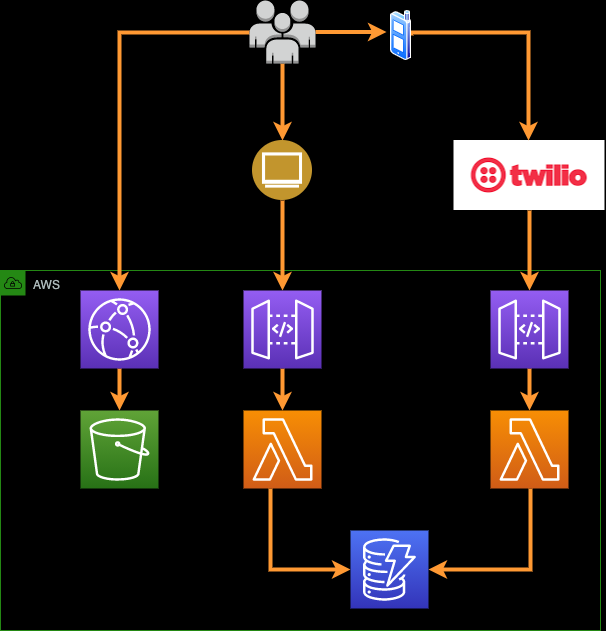

# Serverless Reference Architecture: Vote Application

## Note: The Vote Application serverless reference architecture was originally in the lambda-refarch-webapp repository and has since moved to this repository.

README Languages:  [DE](README/README-DE.md) | [ES](README/README-ES.md) | [FR](README/README-FR.md) | [IT](README/README-IT.md) | [JP](README/README-JP.md) | [KR](README/README-KR.md) |
[PT](README/README-PT.md) | [RU](README/README-RU.md) |
[CN](README/README-CN.md) | [TW](README/README-TW.md)

Serverless Reference Architecture illustrating how to build dynamic web applications using [AWS Lambda](http://aws.amazon.com/lambda/) and Amazon API Gateway to authenticate and process API requests.

By combining AWS Lambda with other AWS services, developers can build powerful web applications that automatically scale up and down and run in a highly available configuration across multiple data centers&mdash;with zero administrative effort required for scalability, backups, or multi–data center redundancy.

This example looks at using AWS Lambda and Amazon API Gateway to build a dynamic voting application, which receives votes via SMS, aggregates the totals into Amazon DynamoDB, and uses Amazon Simple Storage Service (Amazon S3)to display the results in real time.

The architecture described in this Diagram:

 

- Creates an S3 bucket named <S3BucketName\> to hold your web app.
- Creates a DynamoDB table named `VoteApp` to store votes
- Creates a DynamoDB table named `VoteAppAggregates` to aggregate vote totals
- Creates a Lambda function that allows your application to receive votes
- Creates a Lambda function that allows your application to aggregate votes
- Creates an AWS Identity and Access Management (IAM) role and policy to allow Lambda functions to write to Amazon CloudWatch Logs and write and query the DynamoDB tables

## Dynamic Dashboard

The services and resources configured by the AWS CloudFormation template can be tested with the HTML page `index.html`, which relies on the HTML, JavaScript, and CSS files found in this repo. You can copy these files to the S3 bucket created by the AWS CloudFormation script.

## Instructions
**Important:** 

{cdk} instructions here

This example demonstrates receiving votes via text message from users via a phone number. To duplicate the system built by this architecture, you will need to set up a phone number with a third party, like [Twilio](http://twilio.com). For full details, read [our post](https://medium.com/aws-activate-startup-blog/building-dynamic-dashboards-using-aws-lambda-and-amazon-dynamodb-streams-part-ii-b2d883bebde5) on the [AWS Startup Collection at Medium](https://medium.com/aws-activate-startup-blog).

Step 1 – Create an AWS CloudFormation stack with the [template](https://s3.amazonaws.com/awslambda-reference-architectures/web-app/lambda_webapp.template) using a lowercase name for the stack.

Step 2 – Visit the [API Gateway dashboard](https://console.aws.amazon.com/apigateway/home) in your AWS account and create a new resource with a `/vote` endpoint. Assign a POST method that has the `Integration Request` type of "Lambda Function," and point to the Lambda function created by the AWS CloudFormation script that receives votes from your third-party voting service (in this example, Twilio).

Under `Body Mapping Templates`, set the "Content-Type" to `application/x-www-form-urlencoded`, and add [this mapping template](apigateway-mappingtemplate.txt).

Step 3 – Visit the [Amazon Cognito dashboard](https://console.aws.amazon.com/cognito/home) and create a new identity pool that allows access to unauthenticated identities. Modify the policy document to allow `GetItem` and `Scan` access to the aggregates DynamoDB table created by the AWS CloudFormation script above. This allows unauthenticated users to retrieve data from the vote aggregation table in DynamoDB. Amazon Cognito will provide sample code for the JavaScript platform. Note the value for identity pool ID; you'll need it in step 5.

Step 4 – In the __VoteApp__ table in DynamoDB, create a new [Trigger](https://docs.aws.amazon.com/amazondynamodb/latest/developerguide/Streams.Lambda.html), and point it to the existing Lambda function to [aggregate votes](lambda-functions/aggregate-votes/app.js). This function will monitor any changes to your __VoteApp__ table, writing new, aggregate values into __VoteAppAggregates__.

Step 5 – Copy the HTML, CSS, and JS files from this repo and into the static S3 bucket that was created to hold your dashboard. You'll need to open `refresh.js` and replace default values of `region` and `identity-pool-id` with your own values.

Congratulations! You now should have a working example of the reference architecture. You are able to receive votes in real time, tune your DynamoDB table to handle various levels of incoming traffic, and watch your results change on your dashboard in real time!

## Worth Noting

The AWS CloudFormation script will create two DynamoDB tables for you. Although you are able to specify the read and write capacity through the AWS CloudFormation script, you are not able to specify the table names in the script. This is because the JavaScript code that receives and aggregates votes must know the names of that tables (_VoteApp_ and _VoteAppAggregates_) in advance. If you would like to change the names of your DynamoDB tables, make sure to change the names in the JavaScript files themselves in the code found in both [the aggregate source](/lambda-functions/aggregate-votes/) and [the receiving source](/lambda-functions/receive-vote/).

## Cleanup

To remove all automatically created resources, delete the AWS CloudFormation stack. You will need to manually remove the API Gateway endpoint and the Amazon Cognito identity pool.

Note: Deletion of the S3 bucket will fail unless all files in the bucket are removed before the stack is deleted.

## License

This reference architecture sample is licensed under Apache 2.0.